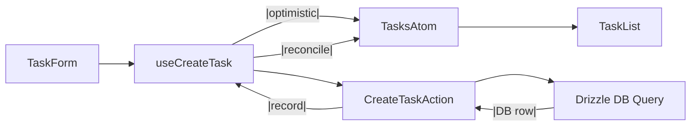

# behave.js Architecture

> A uni-directional layering model that keeps React UI, client-side state, server logic, and external integrations cleanly separated.

## Tech Stack

- **Framework**: Next.js 15.3.2
- **Language**: TypeScript
- **Styling**: Tailwind CSS
- **Database**: libSQL
- **ORM**: Drizzle ORM
- **Authentication**: Better Auth
- **Testing**: Vitest
- **Validation**: Zod
- **State Management**: Jotai

## 1 Three-Layer Architecture

```
+-------------------------------------+
|          FRONTEND LAYER             |
|   Components -> Hooks -> States     |
|          (Browser)                  |
+-------------------------------------+
              |
              v
+-------------------------------------+
|         BACKEND LAYER               |
|   Actions + Routes + Workflows      |
|          (Server)                   |
+-------------------------------------+
              |
              v
+-------------------------------------+
|      INFRASTRUCTURE LAYER           |
|      Models  +  Services            |
|          (Server)                   |
+-------------------------------------+
```

**Critical Rule**: Data flows top to bottom only. No layer may import from layers above it.

| Layer              | Runs on | Core responsibilities                                                      | May import                     | **Must _not_** import / do                 |
| ------------------ | ------- | -------------------------------------------------------------------------- | ------------------------------ | ------------------------------------------ |
| **Frontend**       | Browser | **Components**: Render UI, collect user input, consume custom hooks<br/>**Hooks**: Validate input (Zod), manage state, optimistic updates, call Actions<br/>**States**: Jotai atoms for client state | React, Zod, Jotai, Actions     | Database clients, Drizzle, Models, Services, server-only code |
| **Backend**        | Server  | **Actions**: Auth-aware business logic, orchestrate Models and Services<br/>**Routes**: API endpoints and server-side routing<br/>**Workflows**: Long-running background jobs/processes | Models, Services, auth/context utilities | React, `window`, Jotai atoms, direct DB queries |
| **Infrastructure** | Server  | **Models**: Active Record-style database access (Drizzle ORM)<br/>**Services**: External API integrations (email, payments, notifications) | Drizzle/SQL client, External APIs, SDKs | React, Jotai, Actions, Hooks |

**One-way flow**

- **Infrastructure** never calls **Backend** or **Frontend** (Models/Services don't call Actions/Hooks/Components).
- **Backend** never calls **Frontend** (Actions/Routes don't call Hooks/Components).
- **Frontend** Components never contain server code or manage atoms directly.
- **Frontend** Hooks never touch the database or Models directly.

---

## 2 Folder Layout & Conventions

```
app/
  ▸ tasks/                        ← page "/tasks"
      page.tsx                    ← entry React component
      state.ts                    ← Jotai atoms for this page
      components/
        TaskForm.tsx
        TaskList.tsx
      behaviors/
        create-task/
          actions/
            create-task.action.ts
          hooks/
            use-create-task.ts
          tests/
            create-task.spec.ts          ← E2E test (Playwright)
            create-task.action.test.ts   ← Action unit test
            use-create-task.test.tsx     ← Hook test
          create-task.md                 ← Behavior specification (optional)
        delete-task/
          actions/
            delete-task.action.ts
          hooks/
            use-delete-task.ts
          tests/
            delete-task.action.test.ts
            use-delete-task.test.tsx
shared/                           ← Shared code across features (Infrastructure)
  models/                         ← Active Record-style models
    user.ts
    auth-token.ts
  services/                       ← External integrations
    email/
      email.service.ts
      tests/
        email.service.test.ts
    payments/
      stripe.service.ts
  actions/                        ← Shared server actions (rare)
  hooks/                          ← Shared client hooks (rare)
  states/                         ← Global Jotai atoms
db/
  schema.ts                       ← Drizzle schema definitions
  index.ts                        ← Database client
  migrations/                     ← SQL migrations
lib/                              ← Utility functions
components/                       ← Shared React components
  ui/                             ← shadcn/ui components
```

- Page folders are **singular** to match route segments.
- **State** is defined in a `state.ts` file (sibling to `page.tsx`) containing Jotai atoms for that page.
- **Behaviors** are organized in `behaviors/` folder with subdirectories for `actions/`, `hooks/`, and `tests/`.
- **Hook** files **start with** `use-` and export a handler function (prefixed with `handle`) as the main entry point.
- **Action** files **end with** `.action.ts` and must start with `'use server'` directive.
- **Shared folder** contains Infrastructure layer code (Models, Services) reused across features.
- Tests sit next to the code they verify in a `tests/` subdirectory.

### Behavior Directory Structure

Each behavior is a self-contained feature unit:

```
behaviors/[behavior-name]/
  actions/                        ← Server actions
    [behavior-name].action.ts
  hooks/                          ← Client hooks
    use-[behavior-name].ts
  workflows/                      ← Background jobs (optional)
    [workflow-name]/
      [workflow-name].workflow.ts
      steps.ts
  tests/                          ← All tests for this behavior
    [behavior-name].spec.ts       ← E2E tests (Playwright)
    [behavior-name].action.test.ts ← Action unit tests
    use-[behavior-name].test.tsx  ← Hook tests
  [behavior-name].md              ← Behavior specification (optional)
```

### Workflows

Workflows are long-running background processes that execute outside the request/response cycle. They:
- Run asynchronously in the background
- Support retries, timeouts, and step-based execution
- Can run for extended periods (minutes to hours)
- Are triggered by Actions or Routes

**Workflow structure:**
```
workflows/[workflow-name]/
  [workflow-name].workflow.ts     ← Workflow definition
  steps.ts                        ← Step implementations
```

### Shared Folder (Infrastructure Layer)

The `shared/` folder contains the Infrastructure layer - code reused across multiple features:

- **`shared/models/`** - Active Record-style models that wrap database tables with class methods (`find`, `where`, `save`, `update`). Models encapsulate all database access.

- **`shared/services/`** - External API integrations (email, payments, notifications). Services wrap third-party SDKs with consistent interfaces.

- **`shared/workflows/`** - Background workflows used by multiple behaviors.

- **`shared/actions/`** - Server actions used by 2+ behaviors. Prefer behavior-specific actions when possible.

- **`shared/hooks/`** - Client hooks used by 2+ pages. Prefer behavior-specific hooks when possible.

- **`shared/states/`** - Global Jotai atoms for application-wide state.

**When to use shared vs behavior-specific:**
- Use `shared/` when code is needed by 2+ behaviors/pages
- Use `behaviors/` for feature-specific actions, hooks, and workflows
- Models and Services are always in `shared/` (Infrastructure layer)
- Actions, hooks, and workflows are typically behavior-specific

---

## 3 End-to-End Example — “Create Task”

### 3.1 State `app/tasks/state.ts`

```ts
import { atom } from 'jotai';

export interface Task {
  id: string; // '' while optimistic
  title: string;
  completed: boolean;
  pending?: boolean; // optimism flag
}

export const tasksAtom = atom<Task[]>([]);
export const draftTitleAtom = atom('');
```

---

### 3.2 Components

**TaskForm.tsx**

```tsx
'use client';
import { useState } from 'react';
import { useCreateTask } from '../../behaviors/create-task/use-create-task';

export function TaskForm() {
  const [title, setTitle] = useState('');
  const { handleCreateTask, isLoading, error } = useCreateTask();

  return (
    <form
      onSubmit={(e) => {
        e.preventDefault();
        handleCreateTask(title);
        setTitle(''); // Reset on submit
      }}
      className="flex gap-2"
    >
      <input
        value={title}
        onChange={(e) => setTitle(e.target.value)}
        placeholder="New task…"
        className="border px-2 py-1 flex-1"
        disabled={isLoading}
      />
      <button type="submit" disabled={isLoading}>
        {isLoading ? 'Adding...' : 'Add'}
      </button>
      {error && <span className="text-red-500 text-sm">{error}</span>}
    </form>
  );
}
```

**TaskList.tsx**

```tsx
'use client';
import { useAtom } from 'jotai';
import { tasksAtom } from '../state';

export function TaskList() {
  const [tasks] = useAtom(tasksAtom);

  // Loading and error states handled by individual action hooks

  return (
    <ul className="mt-4 space-y-1">
      {tasks.map((t) => (
        <li
          key={t.id || t.title /* optimistic */}
          className={t.pending ? 'opacity-50 italic' : ''}
        >
          {t.title}
        </li>
      ))}
    </ul>
  );
}
```

**page.tsx**

```tsx
import { TaskForm } from './components/TaskForm';
import { TaskList } from './components/TaskList';

export default function TasksPage() {
  return (
    <main className="mx-auto max-w-md py-8">
      <h1 className="text-xl mb-4">Tasks</h1>
      <TaskForm />
      <TaskList />
    </main>
  );
}
```

---

### 3.3 Hooks

Each hook exports a **single handler function** that serves as the main entry point for the user behavior. This handler (named with the `handle` prefix, e.g., `handleCreateTask`, `handleDeleteTask`) encapsulates all the logic for that specific behavior including validation, optimistic updates, and action calls. Additional event-related functions within the hook should use the `on` prefix (e.g., `onReset`, `onCancel`, `onValidate`) to distinguish them from the main handler.

**use-create-task.ts**

```ts
'use client';
import { useState } from 'react';
import { z } from 'zod';
import { useSetAtom } from 'jotai';
import { tasksAtom, Task } from '../state';
import { createTask } from '../../behaviors/create-task/create-task.action';

const titleSchema = z.string().min(1, 'Title is required');

export function useCreateTask() {
  const [isLoading, setIsLoading] = useState(false);
  const [error, setError] = useState<string | null>(null);
  const setTasks = useSetAtom(tasksAtom);

  // The handler function - main entry point for this behavior
  const handleCreateTask = async (rawTitle: string) => {
    try {
      setIsLoading(true);
      setError(null);

      const title = titleSchema.parse(rawTitle.trim());

      // optimistic record
      const tmp: Task = { id: '', title, completed: false, pending: true };
      setTasks((prev) => [tmp, ...prev]);

      const created = await createTask({ title });
      setTasks((prev) => prev.map((t) => (t === tmp ? created : t))); // reconcile
    } catch (err) {
      setTasks((prev) => prev.filter((t) => t.pending)); // rollback optimistic
      setError(err instanceof Error ? err.message : 'Failed to save task');
      throw err;
    } finally {
      setIsLoading(false);
    }
  };

  return {
    handleCreateTask,  // The main handler for this behavior
    isLoading,
    error
  };
}
```

**use-delete-task.ts**

```ts
'use client';
import { useState } from 'react';
import { useSetAtom } from 'jotai';
import { tasksAtom } from '../state';
import { deleteTask } from '../../behaviors/delete-task/delete-task.action';

export function useDeleteTask() {
  const [isLoading, setIsLoading] = useState(false);
  const [error, setError] = useState<string | null>(null);
  const setTasks = useSetAtom(tasksAtom);

  const handleDeleteTask = async (taskId: string) => {
    try {
      setIsLoading(true);
      setError(null);
      
      // Optimistic removal
      setTasks((prev) => prev.filter(t => t.id !== taskId));

      await deleteTask({ id: taskId });
    } catch (err) {
      // Rollback on error - would need to restore the task
      setError(err instanceof Error ? err.message : 'Failed to delete task');
      throw err;
    } finally {
      setIsLoading(false);
    }
  };

  return {
    handleDeleteTask,
    isLoading,
    error
  };
}
```

---

### 3.4 Action `app/tasks/behaviors/create-task/create-task.action.ts`

```ts
'use server';

import { z } from 'zod';
import { db } from '@/lib/db';
import { tasks } from '@/lib/schema';

const input = z.object({ title: z.string() });

export async function createTask(data: unknown) {
  const { title } = input.parse(data);

  const [row] = await db
    .insert(tasks)
    .values({
      id: crypto.randomUUID(),
      title,
      completed: false
    })
    .returning();

  return row;
}
```

---

### 3.5 Schema `lib/schema.ts`

```ts
import { sqliteTable, text, integer } from 'drizzle-orm/sqlite-core';

export const tasks = sqliteTable('tasks', {
  id: text('id').primaryKey(),
  title: text('title').notNull(),
  completed: integer('completed', { mode: 'boolean' }).notNull().default(false),
});
```

---

### 3.6 Flow Diagram



---

## 4 Testing Strategy

| Layer              | Test style             | Isolation hints                                     |
| ------------------ | ---------------------- | --------------------------------------------------- |
| **Frontend**       |                        |                                                     |
| - Components       | React Testing Library  | Mock custom hooks; assert rendered output & DOM events |
| - Hooks            | React Testing Library + renderHook | Provide in-memory Jotai store; mock Actions         |
| **Backend**        |                        |                                                     |
| - Actions          | Vitest + test database | Use SQLite in-memory; real Drizzle queries, mock Infrastructure services |
| - Routes           | Vitest + supertest     | Integration tests with mocked Infrastructure services |
| - Models           | Vitest + test database | Use SQLite in-memory; test data access methods      |
| - Shared Services  | Vitest + test database | Use SQLite in-memory; test business logic           |
| **Infrastructure** |                        |                                                     |
| - Services         | Vitest + mocked APIs   | Mock external API calls; test retry/error handling  |

No cross-layer stubs: each test concerns one layer only.

---


